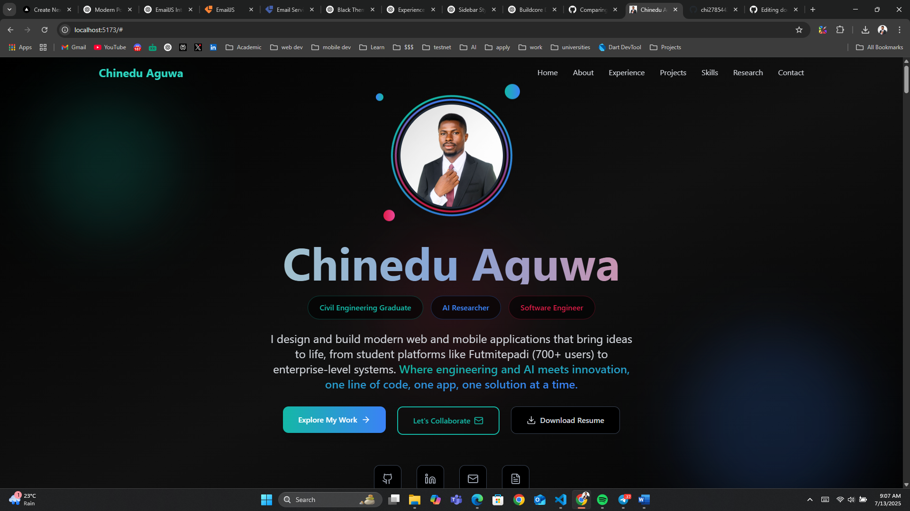
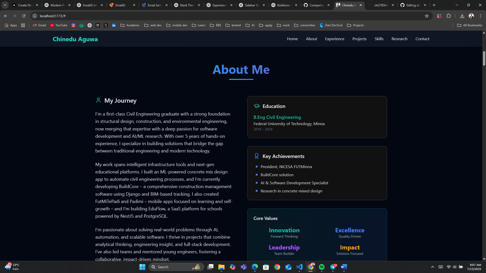
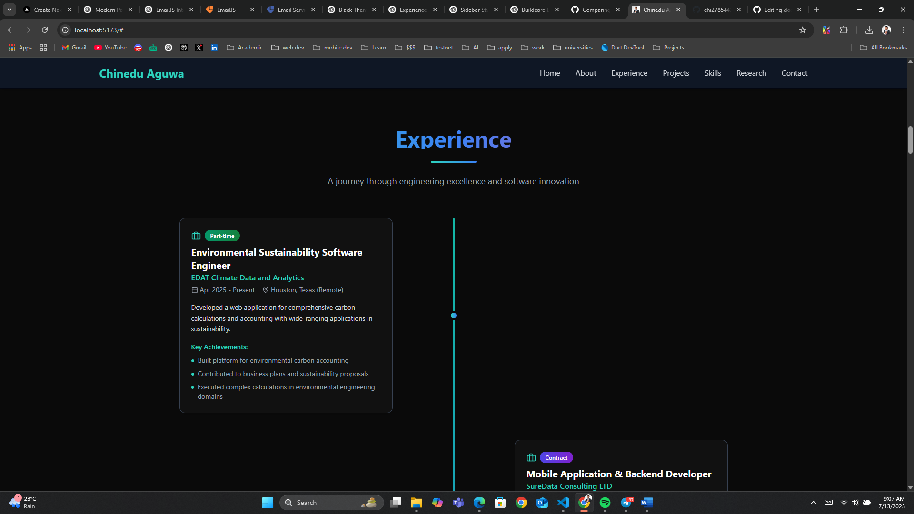
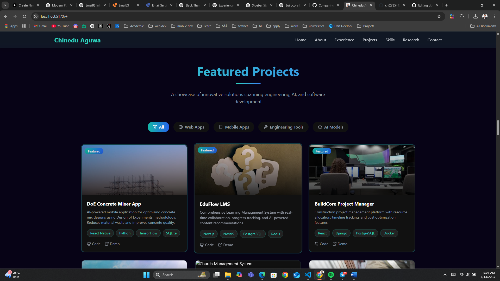
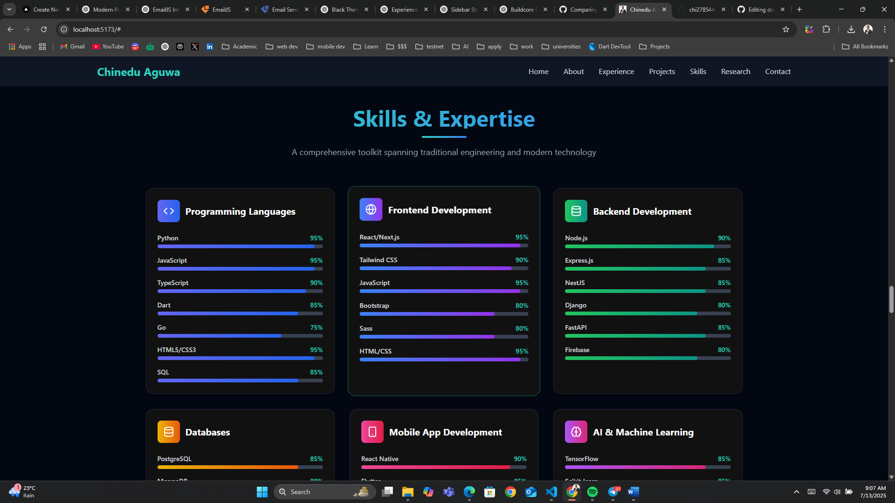
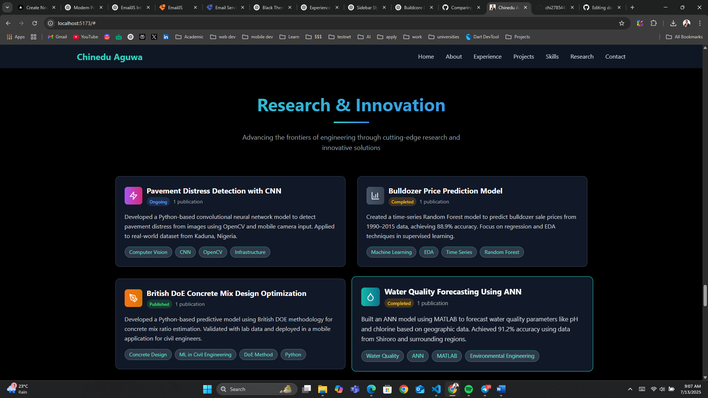
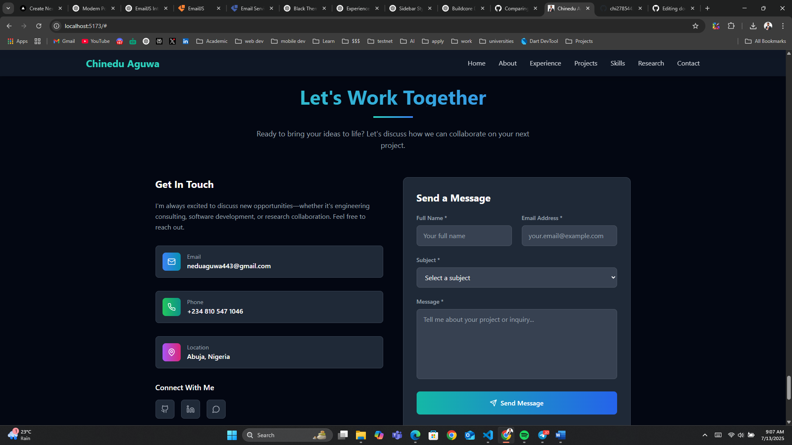

# 🧠 Chinedu Aguwa – Portfolio Website

A sleek, animated, and mobile-responsive **personal portfolio** built with **React**, **Framer Motion**, and **TailwindCSS**. Showcasing projects, skills, and research interests in Civil Engineering, Software Development, and Artificial Intelligence.

<p align="center">


</p>

---

## 📸 Screenshots

<p align="center">
  
  
  
  
  
  
  
</p>

---

## ✨ Features

- 🎯 **Hero Section** – Eye-catching animated intro with call-to-actions
- 🧑🏽‍💻 **Project Highlights** – Real-world apps like _FutMiTePadi_ and _EduFlow_
- 🛠 **Skills Overview** – Frontend, Backend, AI, and Civil Engineering tools
- 📚 **Research Interests** – AI in Civil Engineering, Structural Health Monitoring, River Ice Modeling, and more
- 📱 **Mobile Responsive** – Fully optimized for all screen sizes
- 🌈 **Framer Motion Animations** – Smooth and modern UI transitions
- 📩 **Contact Section** – Lets users reach out directly
- 📜 **Resume Download** – Downloadable CV button included
- 🔗 **Social Links** – GitHub, LinkedIn, and email integration

---

## 🚀 Tech Stack

| Category   | Tech Used     |
| ---------- | ------------- |
| Frontend   | React         |
| Styling    | TailwindCSS   |
| Animation  | Framer Motion |
| Icons      | Lucide React  |
| Build Tool | Vite          |

---

## 📁 Project Structure

```bash
.
├── public/               # Static files (images, resume)
├── src/
│   ├── assets/           # Logos, images, etc.
│   ├── components/       # Reusable sections (Hero, Header, Footer, etc.)
│   ├── pages/            # Optional: About, Projects, etc.
│   ├── App.tsx           # Main app layout
│   └── main.tsx          # Vite entry point
├── tailwind.config.js
├── vite.config.ts
└── index.html
```

---

## ⚙️ Getting Started

### 1. Clone the Repo

```bash
git clone https://github.com/chi2785443/portfolio-website.git
cd portfolio-website
```

### 2. Install Dependencies

```bash
npm install
# or
yarn install
```

### 3. Run the Dev Server

```bash
npm run dev
```

Visit [http://localhost:5173](http://localhost:5173) in your browser to view the portfolio.

---

## 🧪 Build for Production

```bash
npm run build
```

---

## 🛠️ Linting

```bash
npm run lint
```

---

## 📄 License

This project is licensed under the **MIT License**.

---

## 👨🏽‍🔧 Author

**Chinedu Aguwa**
📧 [neduaguwa443@gmail.com](mailto:neduaguwa443@gmail.com)
📞 +234 810 547 1046
[LinkedIn](https://www.linkedin.com/in/chinedu-aguwa/) • [GitHub](https://github.com/chi2785443)
